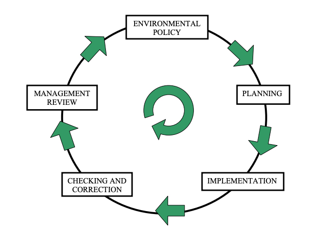

### 🌍 **1. What is Total Quality Environmental Management (TQEM)?**

**Definition**:
TQEM is the integration of Total Quality Management (TQM) principles into environmental management, aiming for continual environmental improvement with stakeholder and legal compliance.

**Core Focus**:

* Process-oriented environmental control
* Pollution prevention
* Compliance with laws and ISO 14000 standards
* Sustainable development

**Mnemonic – “PEER”**

* **P**rocess improvement
* **E**nvironmental responsibility
* **E**fficiency (resource/waste)
* **R**egulatory compliance

---

### 📘 **2. Introduction to ISO 14000 Series**

**ISO 14000** = A family of international standards for **Environmental Management Systems (EMS)**.

#### ⭐ Key Standard: **ISO 14001**

Core standard for setting up and certifying an EMS.

#### 📚 Other Key Standards:

* **ISO 14004**: General EMS guidelines
* **ISO 14010**: Environmental auditing
* **ISO 14020–25**: Environmental labelling
* **ISO 14030**: Environmental performance evaluation
* **ISO 14031**: Guidelines on environmental indicators
* **ISO/NP 14030**: Green bonds for environmental assets
* * **ISO 14064**: Green house gases 
* * **ISO 14046**: Water footprint management
  

---

### 🔄 **3. ISO 14001:2015 EMS Flow**

**Mnemonic – “PAST CARE”**

1. **P**olicy formation
2. **A**spects & Impacts identification
3. **S**ignificance determination
4. **T**argets & objectives setting
5. **C**ommunication, training
6. **A**udit (internal/external)
7. **R**eview (management)
8. **E**nhancement (corrective/preventive actions)

📊 *See flow diagram (Fig. 5.1.1 in textbook) for step-by-step logic of ISO 14001 EMS cycle.*

---

### 🧾 **4. ISO 14000 Compliance Benefits**

**Internal Benefits**:

* Waste reduction
* Energy/resource efficiency
* Legal risk minimization
* Lower cost of permits

**External Benefits**:

* Improved public image
* Competitive market position
* Easier investor access
* Customer & regulatory trust

---

### 📜 **5. Principles of ISO 14000 Series**

**Designed to be**:

* Cost-effective & flexible
* Globally applicable
* Internally & externally verifiable
* Scientifically based
* Stakeholder inclusive
* Environmentally comprehensive (products + systems)

**Real-World Note**:
Many companies align ISO 14000 with **CSR** and **Sustainability Reporting (e.g., GRI)**.

---

### 🏢 **6. EMS Certification Process (ISO 14001)**

Environmental Management System (EMS) certification under ISO 14001 involves a structured approach to ensure organizations meet environmental obligations and improve sustainability practices.

**Expanded 7 Phases of EMS Certification (Mnemonic – “EDOISAF”)**:

1. **E – Education Plan**:

   * Awareness sessions for leadership and staff.
   * Communicate relevance of ISO 14001.
   * Build internal support and understanding of environmental roles.

2. **D – Document System**:

   * Develop EMS manual, procedures, policies, regulatory documents.
   * Include emergency plans, environmental objectives, legal compliance.
   * Align with existing safety, quality, and operational systems.

3. **O – Organize EMS**:

   * Integrate EMS into daily operations and departments.
   * Assign roles and responsibilities (e.g., EMS coordinator, audit team).
   * Develop structure for communication and control.

4. **I – Internal Audit**:

   * Conduct first internal EMS audit to assess preparedness.
   * Identify non-conformities and scope for improvement.
   * Provide audit training if needed.

5. **S – Select Registrar**:

   * Choose a third-party certification body accredited for ISO 14001.
   * Submit EMS documentation for review.

6. **A – Audit Conducted**:

   * Registrar performs official external audit (Stage 1 & Stage 2):

     * **Stage 1**: Review documents and site preparedness.
     * **Stage 2**: Comprehensive assessment of implementation.

7. **F – Final Registration**:

   * Address non-conformities (if any) from audit report.
   * Registrar issues ISO 14001 certificate.
   * Certification valid for 3 years (surveillance audits annually).

📅 **Typical Timeline**:

* 6 months to 2 years depending on:

  * Organization’s size and complexity
  * Maturity of existing systems
  * Staff involvement and documentation readiness

🔁 **Post-Certification**:

* Annual surveillance audits
* Full recertification every 3 years
* Continuous improvement through review, training, and corrective action

---

### 🌱 **7. Foundation for Sustainable Development**

ISO 14000 embeds sustainability into EMS by encouraging:

* Continuous improvement
* Site-specific customization
* Ethical, legal, and ecological accountability
* Inclusion in environmental education (e.g., senior design projects in universities)
